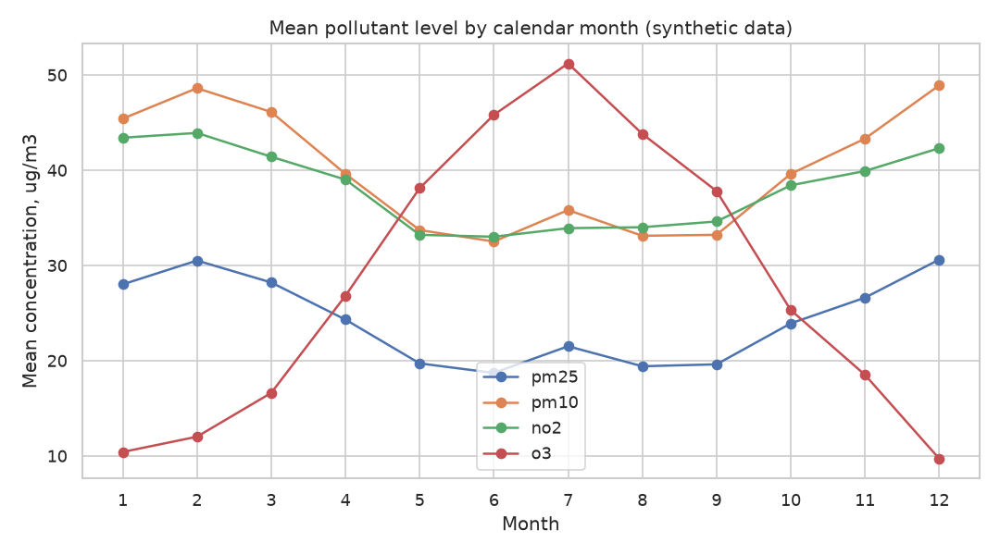
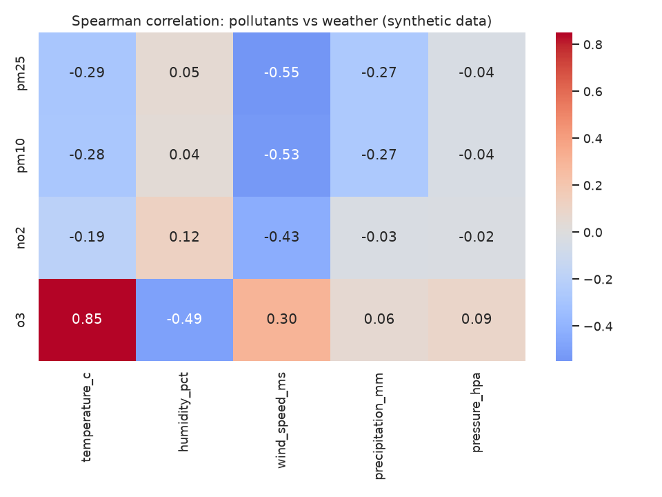
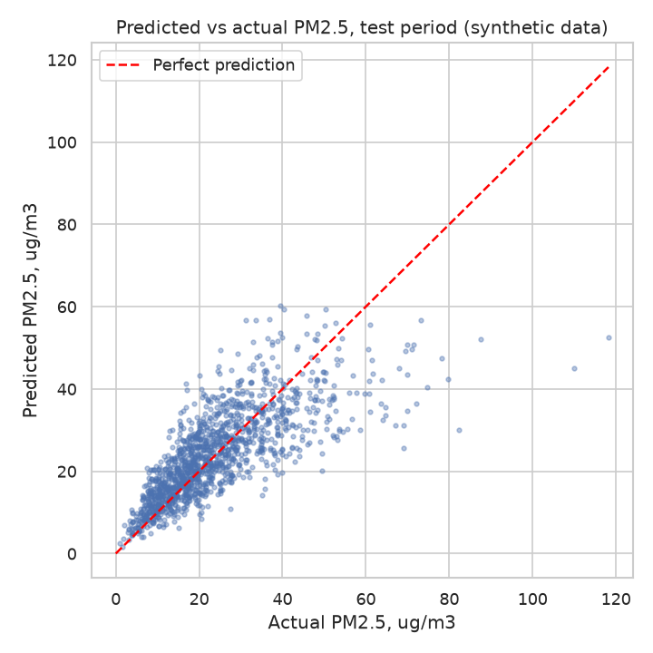

# Air Quality Analysis

City air pollution trends, seasonality and correlation with weather.

> **Note:** all data in this project is **synthetic**. It is generated by `src/data_generator.py` with a fixed random seed. It is not real measurement data, and no conclusion drawn from it applies to a real city.

## Business question

How does air pollution (PM2.5, PM10, NO2, O3) change over time and across seasons in a city, and how strongly is it related to weather conditions such as temperature, wind, humidity and precipitation?

## Goal

Build a reproducible analysis that:
1. describes long-term trends and seasonal patterns of each pollutant,
2. compares monitoring stations of different types (traffic, urban background, industrial, suburban),
3. quantifies the relationship between pollutants and weather variables,
4. gives a simple, interpretable model of daily PM2.5 as a function of weather and season.

## Plan of the work

1. **Data generation** (`src/data_generator.py`): create synthetic station metadata and daily measurements.
2. **EDA** (`src/eda.py`): data quality checks, distributions, time series plots, seasonality by month and weekday, station comparison.
3. **Analysis / model** (`src/analysis.py`, `src/utils.py`): Spearman correlation analysis and a regression model for PM2.5 with time-based validation.
4. **SQL** (`sql/queries.sql`, `src/run_sql.py`): queries for monthly averages, station rankings, days exceeding a threshold and more.
5. **Tests**: pytest checks in `tests/` for the data generator and the utility functions (see "Tests" below).

## Dataset (synthetic)

Two CSV tables are written to `data/`:

| File | Description | Rows |
|------|-------------|------|
| `data/stations.csv` | Metadata of 4 monitoring stations | 4 |
| `data/daily_measurements.csv` | Daily pollutant and weather values per station, 2022-01-01 to 2024-12-31 | 4 x 1096 = 4384 |

The generator builds in a seasonal temperature cycle, a heating-season effect on pollutants, wind dilution, rain washout, and a small share of missing values. See `data_description.md` for all columns.

## How to run

From the project root:

```bash
pip install -r requirements.txt
python src/data_generator.py
python src/eda.py
python src/analysis.py
python src/run_sql.py
python -m pytest -q
```

The generator creates the `data/` folder if needed and writes the CSV files. Running it again with the same seed (42) produces identical files.

## Tests

Run all tests from the project root:

```bash
python -m pytest -q
```

| File | What it checks |
|------|----------------|
| `tests/test_data_generator.py` | Column names, row count (4 stations x 1096 days), unique keys, date range, value ranges (clipping bounds), PM10 above PM2.5, small share of missing values, reproducibility with the fixed seed, English-only notes file |
| `tests/test_utils.py` | Feature building, time-based split without overlap, regression metrics |
| `tests/test_utils_extra.py` | Smearing factor, dropping rows with a missing target, error when data files are missing |

The tests generate data in memory with seed 42, so they do not need the files in `data/` or `figures/`, and they run in a few seconds.

## Exploratory data analysis

`src/eda.py` prints data quality checks (shape, dtypes, missing values, key integrity, date range), descriptive statistics and aggregations (by station, year, month, weekday, dry vs rainy days, Spearman matrix). It saves four charts to `figures/`:

| File | Content |
|------|---------|
| `pm25_monthly_by_station.png` | Monthly mean PM2.5 time series per station |
| `seasonality_by_month.png` | Mean pollutant levels by calendar month |
| `pm25_by_station_type.png` | PM2.5 distribution by station type (box plot) |
| `correlation_heatmap.png` | Spearman correlation of pollutants with weather variables |

## Method (analysis and model)

`src/analysis.py` runs two steps; shared logic (data loading, feature preparation, time split, metrics) lives in `src/utils.py`.

**1. Correlation analysis.** For every pollutant-weather pair, Spearman rank correlation (rho) with its p-value is computed on pairwise complete observations. Spearman is used because the relationships are not necessarily linear and the pollutant distributions are skewed.

**2. PM2.5 regression model.**
- *Target:* daily PM2.5, modelled on the log scale because the effects of wind, rain and season are multiplicative; predictions are back-transformed with a Duan smearing factor.
- *Features:* temperature, humidity, wind speed, precipitation, pressure, heating degrees (how far temperature is below 15 C), rainy-day flag (precipitation > 1 mm), weekend flag, cyclic month encoding (sin/cos) and station type dummies (suburban is the baseline).
- *Model:* standardised linear regression (scikit-learn), so coefficients are comparable across features.
- *Validation:* time-based split, training on days before 2024-01-01 and testing on 2024. Rows with missing PM2.5 are dropped.
- *Baseline:* the training-period mean PM2.5 of each station type.
- *Metrics:* MAE, RMSE and R2 on the original ug/m3 scale.
- *Comparison:* the same model on a random 80/20 split (`random_state=42`), reported only to show how a split that ignores time order can differ from the time-based one.

**Outputs.** Printed metrics and coefficients, `reports/metrics.json` (split sizes, metrics for model, baseline and random split, coefficients, all Spearman results) and two charts in `figures/`:

| File | Content |
|------|---------|
| `pm25_pred_vs_actual.png` | Predicted vs actual PM2.5 on the test period |
| `pm25_model_coefficients.png` | Standardised coefficients of the log(PM2.5) model |

## SQL analysis

`sql/queries.sql` contains 8 commented queries in the SQLite dialect. Each query is preceded by a comment line starting with `-- Q<n>:` that states the question it answers. `src/run_sql.py` loads `stations.csv` and `daily_measurements.csv` into an in-memory SQLite database (`pandas.to_sql`), splits the file into statements, runs each one and prints the description with the first 10 rows of the result. No database file is created.

| Query | Question |
|-------|----------|
| Q1 | Monthly mean PM2.5 and PM10 across all stations |
| Q2 | Station ranking by overall mean PM2.5 (window function `RANK`) |
| Q3 | Days per station and year above a PM2.5 threshold of 25 ug/m3 (an illustrative value, not a regulatory claim) |
| Q4 | Seasonal pattern: mean pollutants and temperature by calendar month |
| Q5 | Dry vs rainy days by station type (join with `stations`) |
| Q6 | The 10 days with the highest city-wide mean PM2.5 and their weather |
| Q7 | PM2.5 and NO2 by wind speed band (`CASE`) |
| Q8 | Year-over-year change of annual mean PM2.5 (CTE and `LAG`) |

```bash
python src/run_sql.py
```

Missing values are NULL in SQL, so `AVG` and `COUNT` skip them. The query results come from the synthetic data and are printed at run time.

## Results

All numbers below come from the output of `src/eda.py`, `src/analysis.py` and `src/run_sql.py` on the synthetic data (seed 42).

### Data

- 4384 station-day rows. PM2.5 has 4287 non-missing values, so 4287 rows are usable for modelling.
- Mean PM2.5 is 24.23 ug/m3 (median 21.0, max 123.6).

### Stations

| Station | Type | Mean PM2.5 | Mean NO2 |
|---------|------|-----------:|---------:|
| S01 | traffic | 30.4 | 53.0 |
| S03 | industrial | 27.6 | 41.4 |
| S02 | urban_background | 23.3 | 36.9 |
| S04 | suburban | 15.7 | 21.0 |

### Seasonality and trend

- Monthly mean PM2.5 is highest in December (30.6) and February (30.5), and lowest in June (18.7).
- O3 shows the opposite pattern: 51.2 in July versus 9.7 in December.
- Annual mean PM2.5: 24.6 (2022), 24.7 (2023), 23.4 (2024). The SQL year-over-year change is +0.11 for 2023 and -1.24 for 2024.



### Weather relationships (Spearman)

| Pair | rho |
|------|----:|
| O3 vs temperature | 0.85 |
| PM2.5 vs wind speed | -0.55 |
| PM10 vs wind speed | -0.53 |
| O3 vs humidity | -0.49 |
| NO2 vs wind speed | -0.43 |
| PM2.5 vs temperature | -0.29 |
| PM2.5 vs precipitation | -0.27 |

- Mean PM2.5 by wind band: 33.2 (below 2 m/s), 25.2 (2 to 4 m/s), 18.8 (4 to 6 m/s), 12.0 (6 m/s and above).
- Mean PM2.5 on dry days is 26.3 versus 17.3 on rainy days (precipitation > 1 mm).



### PM2.5 regression model

Time-based split: train 2852 rows (before 2024-01-01), test 1435 rows (2024).

| Model | MAE | RMSE | R2 |
|-------|----:|-----:|---:|
| Linear model (train) | 6.55 | 9.35 | 0.605 |
| Linear model (test) | 6.26 | 8.89 | 0.577 |
| Baseline: station-type mean (test) | 9.69 | 12.73 | 0.133 |
| Linear model, random 80/20 split (test) | 6.51 | 9.18 | 0.589 |

Largest standardised coefficients on log(PM2.5): wind speed -0.358, traffic type 0.289, industrial type 0.256, heating degrees 0.212, urban background type 0.172, rainy day -0.120.



## Conclusions

- In this synthetic dataset, PM2.5 is higher in winter and lower in summer, while O3 follows the opposite pattern (monthly means above).
- Wind speed is the strongest weather correlate of PM2.5 (rho = -0.55), and mean PM2.5 falls from 33.2 to 12.0 between the lowest and highest wind bands.
- Rainy days have lower mean PM2.5 than dry days (17.3 vs 26.3).
- The traffic station has the highest mean PM2.5 (30.4) and the suburban station the lowest (15.7).
- The linear model beats the station-type baseline on the 2024 test period (MAE 6.26 vs 9.69; R2 0.577 vs 0.133).
- Test R2 (0.577) is close to the random-split R2 (0.589), so on this data the split choice changed the result only slightly.
- The annual mean PM2.5 changes little over three years (24.6, 24.7, 23.4). With only three years, no long-term trend is claimed.

## Limitations & next steps

**Limitations**
- The data is **synthetic**, generated with built-in effects of temperature, wind, rain and heating season. Good model fit mostly shows that the simulated structure is recovered, not that the results hold for a real city.
- The model is linear and has no lagged features, so it ignores multi-day pollution episodes.
- Spearman correlations describe association only, not causation. Weather variables are also correlated with each other (for example temperature and humidity: -0.58).
- Only three years of data are available, which is too short to judge trends.

**Next steps**
- Add lagged PM2.5 and weather features (previous day values).
- Try non-linear models (for example gradient boosting) and compare them to the linear model on the same time-based split.
- Add confidence intervals or cross-validation with several time-based folds.
- Repeat the workflow on real open monitoring data, if available, to check which findings carry over.

---

*This is a training project that uses synthetic data. Generated by AI.*
